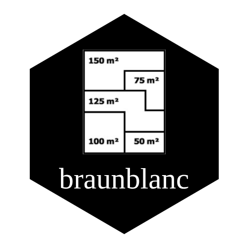

# braunblanc 

<!-- badges -->


Herramientas para el análisis fitosociológico de comunidades vegetales en R.
Implementa el flujo completo desde la lectura de matrices Braun-Blanquet hasta
la exportación de informes Excel y gráficos, pasando por estadísticos clásicos,
ordenaciones multivariadas y análisis de diversidad.

## Instalación

```r
# install.packages("devtools")
devtools::install_github("jcarocont/braunblanc@main")
```

## Flujo de uso

```r
library(braunblanc)

# 1. Leer y transformar
bb <- read_bbtable("datos.xlsx") |> bb_transform()

# 2. Calidad
bb_quality(bb) |> print()

# 3. Estadísticos
bb_stat_sp(bb)
bb_stat_relev(bb)
bb_stat_form(bb, method = "todos")

# 4. Tablas fitosociológicas
bb_constancia_table(bb)
bb_synoptic_table(bb)
bb_fidelity(bb, method = "phi")

# 5. Ordenaciones
dist  <- bb_distance(bb, method = "bray", hellinger = TRUE)
nmds  <- bb_nmds(dist)
pcoa  <- bb_pcoa(dist)

bb_nmds_plot(bb, nmds, ovals = TRUE)
bb_pcoa_plot(bb, pcoa, ovals = TRUE)
bb_plot_dendrograma(dist)

# 6. Informe completo
bb_construir_informe(bb, name = "proyecto-flora",
                     format = "excel-y-plots",
                     out_dir = "resultados/")
```

## Funciones principales

### Lectura y transformación
| Función | Descripción |
|---|---|
| `read_bbtable()` | Lee Excel con fuzzy match de hojas y columnas |
| `bb_transform()` | Convierte valores BB a numérico |
| `bb_scale_default()` | Escala estándar Braun-Blanquet |

### Estadísticos
| Función | Descripción |
|---|---|
| `bb_stat_sp()` | Frecuencia, cobertura, IVI y constancia por especie |
| `bb_stat_relev()` | Riqueza, diversidad y cobertura por relevé |
| `bb_stat_form()` | Agregados por formación vegetal (`"relev"` o `"todos"`) |
| `bb_rare_species()` | Especies raras por umbral de frecuencia y cobertura |
| `bb_dom_range()` | Rango-dominancia global o por formación |

### Tablas fitosociológicas
| Función | Descripción |
|---|---|
| `bb_constancia_table()` | Tabla de constancia (I–V, numérico o %) |
| `bb_synoptic_table()` | Tabla sintética cobertura media + constancia |
| `bb_fidelity()` | Fidelidad por phi o IndVal |
| `bb_indval()` | Especies indicadoras con permutaciones (`indicspecies`) |
| `bb_sp_x_form()` | Presencia y cobertura por especie × formación |

### Ordenaciones
| Función | Descripción |
|---|---|
| `bb_distance()` | Matriz de distancias (`vegan::vegdist`, opcional Hellinger) |
| `bb_nmds()` | NMDS |
| `bb_pcoa()` | PCoA |
| `bb_plot_dendrograma()` | Dendrograma con k automático por gap statistic |
| `bb_nmds_plot()` | Plot NMDS con elipses por formación |
| `bb_pcoa_plot()` | Plot PCoA con elipses por formación |
| `bb_score_species()` | Scores de especies top IVI en espacio NMDS |

### Análisis multivariados
| Función | Descripción |
|---|---|
| `bb_permanova()` | PERMANOVA + Betadisper + SIMPER |
| `bb_accumulation()` | Curva de acumulación general y por formación |

### Calidad e informes
| Función | Descripción |
|---|---|
| `bb_quality()` | Estadísticas de calidad del dataset |
| `bb_construir_informe()` | Exporta Excel y/o gráficos PNG |

## Formato de entrada

El input es un archivo `.xlsx` con dos hojas:

- **matriz** — especies en filas, parcelas en columnas (nombres numéricos), valores BB (`r`, `+`, `1`–`5`)
- **metadata** — columnas `parcela` y `formacion` obligatorias

Los nombres de hojas y columnas se detectan por fuzzy match — toleran typos y
variantes (`"metadata_muestreo_sitioA"`, `"Matriz cobertura"`, etc.).

## Escala Braun-Blanquet por defecto

| Símbolo | Cobertura media (%) |
|---------|-------------------|
| r | 0.1 |
| + | 0.5 |
| 1 | 5 |
| 2 | 25 |
| 3 | 50 |
| 4 | 75 |
| 5 | 97.5 |

Se puede personalizar con `bb_transform(bb, scale = c(...))`.

## Licencia

MIT © [Julian Caro](https://github.com/jcarocont)
